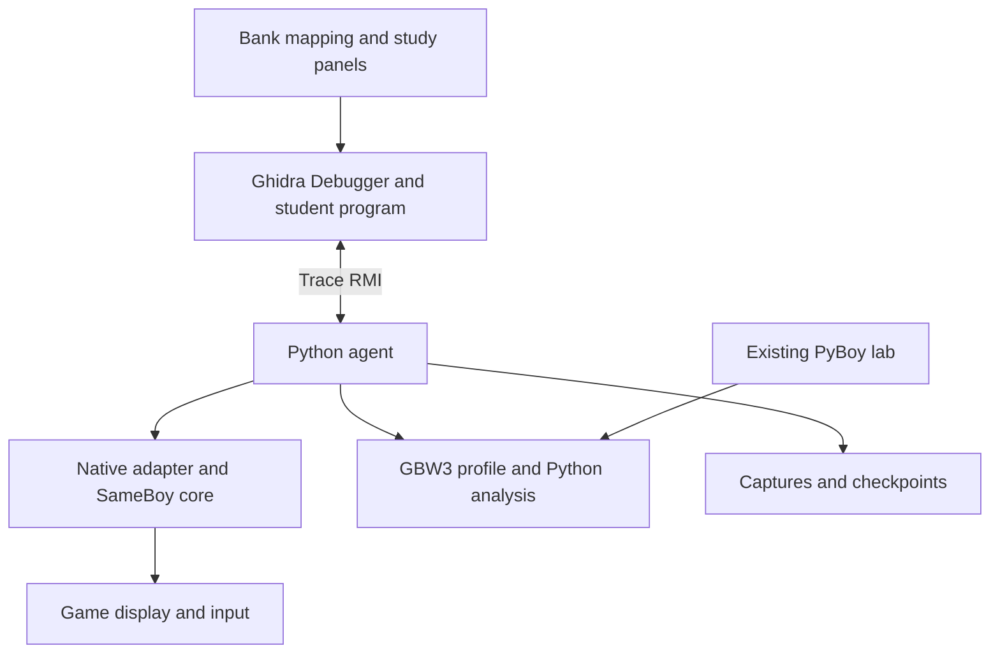

# GBC debugging in Ghidra: implementation plan

Prepared for Joshua and his son's Game Boy Wars 3 learning project. Research date: September 5, 2026.

**Decision:** Build a Ghidra extension backed by a pinned SameBoy core and a Python Trace RMI agent. Preserve the existing PyBoy lab and reuse its game-analysis code. Deliver a working debugger, installer, and guided exercise on the student's target platform. Emulicious is an optional future backend, not a prerequisite for this implementation.

**Status:** This document is a researched implementation specification. The new debugger has not been implemented, compiled, or validated end to end. Prior lab test results below are records inspected from the supplied artifacts, not tests rerun during this planning task.

## 1. Outcome and scope

The student opens his existing annotated program in Ghidra, launches the matching ROM, plays to a battle, pauses, inspects registers and physical memory banks, places a bank-qualified breakpoint or HP write watchpoint, and follows the responsible instruction into his annotated static listing. He can save a checkpoint and repeat an experiment without corrupting his original project, ROM, or battery save.

Required first release:

- Native Ghidra Debugger controls: pause, resume, instruction step, and bank-aware execution breakpoints.
- Register and CPU-visible memory views, physical bank inspection, historical bank mapping, and persistent traces.
- CPU-origin read/write/access watchpoints with explicit coverage and stop semantics. Precise HP write attribution must work outside the known helper routines.
- A simple playable game window with responsive input and event processing while paused.
- Checkpoint save/load, register and RAM edits in explicit experiment mode, and safe recovery from process/connection failures.
- Ghidra unit/event panels and a ROM-fingerprinted Game Boy Wars 3 profile.
- Installer/bootstrap, doctor diagnostics, a redistributable test ROM, and a short first-session guide.

Step-over/out are required for ordinary supported CALL/RET/RST behavior before claiming those controls work. The game's far-call convention needs a separate verified action or clearly limited behavior; do not let it delay reliable step-into and watchpoints. A docked game screen, full reverse execution, generic stack unwinding, automatic decompilation repair, new emulator backends, and every-platform binaries are later milestones.

This updates the earlier companion-first plan because the requested outcome is now full native Ghidra debugging. A file/event companion is a useful intermediate milestone, not completion of this task.

## 2. Existing assets and facts to preserve

The handoff includes the original Live Lab and Study Pack archives, their guides, and the earlier integration plan. Neither the commercial ROM nor the student's GZF is bundled; provide them locally to the implementing agent.

| Asset/fact | Implementation consequence |
|---|---|
| Ghidra 11.3.1 with GhidraBoy | First compatibility target if still installed; copy the project before changes |
| Python 3.12, PyBoy 2.7.0 in recorded validation | Keep the legacy lab environment working; isolate new agent dependencies |
| Student ROM SHA-256 `e779a6b56575a2afafb7e1e99411b23d7400a8fddbda8bd52c660b7903c3b451` | Enable the GBW3 profile only on an exact byte match |
| 64 mapped ROM banks; prior guide records 79 blocks and 1,792 recognized functions | Inspect the actual program; these are a historical baseline, not future assertions |
| Earlier standalone ROM differs from the GZF ROM | Do not transfer all balance data or annotations by filename |
| `ExportGBW3ROM.java` | Reuse to export mapped ROM bytes from an opened Ghidra program if necessary |
| `gbw3_core.py` | Reuse table/glyph decoding, damage reconstruction, and isolated routine test vectors |
| `gbw3_lab.py` | Reuse unit decoding, address conventions, event interpretation, and verified caller checks |
| `GBW3StudyBookmarks.java` | Preserve opt-in, idempotent study annotations |

The recorded validation contains 11 integration tests, 256 initiative inputs, 150 generated damage cases, eight modifier cases, and three synthetic firing-order cases. It also records boot/menu/save-state checks. It explicitly does **not** establish a full map battle or interactive desktop keyboard/focus behavior.

Two existing assumptions must not become debugger truth:

1. The old lab's FF80 ROM-bank value is a **game-maintained shadow**, not an authoritative mapper query. Display it as a diagnostic alongside actual emulator mapper state.
2. Old hook events and frame-end snapshots can describe different times. Preserve their precision labels; do not merge them into a fictional instruction-time capture.

The student's OS, CPU architecture, and absolute project path are not established. Discover the deployment target. Do not infer Windows from generic instructions or macOS from Joshua's machine. If Codex runs on another machine, distinguish build host from deployment target and finish target-independent work before asking for the missing target detail.

## 3. Research findings and version policy

### SameBoy

The latest release returned by the upstream release API was **v1.0.3**, published March 4, 2026. Source review covered v1.0.3 and, where noted, upstream commit `213a12ce93d66b105a113debd9396306066a7cfc`. Prefer v1.0.3 as the initial reproducible dependency; resolve its tag to an immutable commit and record build flags and checksums. Move to a later commit only for a demonstrated requirement. [Release](https://github.com/LIJI32/SameBoy/releases/tag/v1.0.3).

The core has public register, direct-memory, safe-read, execution callback, memory callback, debugger, and save-state APIs. Its build system includes a library target. These are sufficient foundations for a small native adapter; they are not a prebuilt Ghidra backend. [Core header](https://github.com/LIJI32/SameBoy/blob/v1.0.3/Core/gb.h), [memory header](https://github.com/LIJI32/SameBoy/blob/v1.0.3/Core/memory.h), [save-state header](https://github.com/LIJI32/SameBoy/blob/v1.0.3/Core/save_state.h), [Makefile](https://github.com/LIJI32/SameBoy/blob/v1.0.3/Makefile).

The built-in debugger already has step/next/finish, banked addresses, and conditional watchpoints. Adapt its behavior where useful, but do not make parsing human-readable console output the production data protocol. [Debugger documentation](https://sameboy.github.io/debugger/), [debugger API](https://github.com/LIJI32/SameBoy/blob/v1.0.3/Core/debugger.h).

### Ghidra

Use Trace RMI, not an old GADP/TargetObject adapter. The custom agent supplies a schema, state publication, methods, and launcher. [Agent authoring](https://ghidra.re/ghidra_docs/GhidraClass/Debugger/B5-AddingDebuggers.html).

Pin `ghidratrace` to the selected Ghidra distribution. Source signatures differ: the inspected 11.3.1 client has `create_trace(path, language, compiler='default')`; inspected newer development code adds an `extra` argument. Register values in the 11.3.1 Trace RMI client are byte arrays encoded **big-endian**, regardless of the target's memory endianness. [11.3.1 client](https://github.com/NationalSecurityAgency/ghidra/blob/Ghidra_11.3.1_build/Ghidra/Debug/Debugger-rmi-trace/src/main/py/src/ghidratrace/client.py).

GhidraBoy supplies `SM83:LE:16:default`, compiler `default`, base memory space `ram`, and uppercase CPU register names. Bank overlays are generated as `rom18`, `wram3`, etc. Preserve the language ID and project compatibility. [Language](https://github.com/Gekkio/GhidraBoy/blob/main/data/languages/sm83.ldefs), [register definitions](https://github.com/Gekkio/GhidraBoy/blob/main/data/languages/sm83.sinc), [loader](https://github.com/Gekkio/GhidraBoy/blob/main/src/main/java/fi/gekkio/ghidraboy/GameBoyLoader.java).

GhidraBoy was archived June 10, 2026; its latest listed release supports 11.4.2. Ghidra's release page lists 12.1.3. Start with the installed working combination; validate a current-version extension build on a copy as a separate compatibility lane. Do not upgrade the student's only project or promise support for untested combinations. [GhidraBoy releases](https://github.com/Gekkio/GhidraBoy/releases), [Ghidra releases](https://github.com/NationalSecurityAgency/ghidra/releases).

### Alternatives

Emulicious's VS Code extension uses a DAP server on default port 58870. Bank identity, physical memory, arbitrary data breakpoints, and no-source behavior still require a runtime probe. If pursued later, save actual initialization/capability responses and behavior tests. [Extension source](https://github.com/Calindro/emulicious-debugger/blob/172b0b88ae682badfb8b6b6e9b0c480946db2c65/src/extension.ts).

The Ghidra development-tree DAP module is a **server for DAP clients**, not an Emulicious adapter. mGBA's inspected GDB stub is ARM-specific. Neither is a shortcut to this SM83 integration. [Ghidra DAP](https://github.com/NationalSecurityAgency/ghidra/blob/master/Ghidra/Debug/Debugger-dap/src/main/help/help/topics/dap/dap.html), [mGBA GDB source](https://github.com/mgba-emu/mgba/blob/507061afd70489a0c2ffc8ba26d8f9b53d6cf7d6/src/debugger/gdb-stub.c).

## 4. Architecture



### Native adapter

Use a small C ABI over a pinned SameBoy core, loaded with ctypes or compiled CFFI into a Python sidecar process. The C layer handles execution loops, hooks, filters, and bounded event storage. Keep `GB_gameboy_t` opaque to Python; return explicit fixed-width structs and copied buffers. Never mirror SameBoy's private structure layout in Python.

Expose create/destroy, ROM loading, execution control, register access, peek/read, experiment writes, mapper state, breakpoint/watchpoint management, event draining, framebuffer/input, and checkpoints. This API is a **design contract**; it is not a claim that SameBoy exports these normalized methods directly.

A small, documented patch to the pinned core is acceptable if public APIs cannot expose reliable stop reasons or committed writes. Keep it separate and test its behavioral boundary. Do not rebuild the emulator or implement another SM83 disassembler.

### Python sidecar

Own one guest machine. Separate native execution ownership, Trace RMI dispatch, and display/event pumping. Use short bounded native execution slices that release the GIL, an atomic pause request, and a serialized command queue. No CPU instruction or memory-access callback should cross into Python on every event during normal play.

Prefer one sidecar process, not a web service or distributed system. Reuse an SDL-based display where possible; keep UI pumping on the appropriate main thread, especially on macOS. Copy frames/input through bounded queues. A separate viewer process is acceptable only if it materially simplifies platform constraints. Do not embed native emulator state inside the Ghidra JVM.

### Ghidra extension

Use standard debugger views and controls. Add only the missing bank-mapping service, explicit bank-aware breakpoint/watchpoint actions, unit/event panels, profile import/export, and launch/setup integration. Reuse Trace RMI for actions; do not add an unrestricted scripting server or duplicate transport.

All Swing updates occur on the event dispatch thread. Process startup, memory retrieval, and other blocking work remain off it.

### Python analysis

Extract pure game decoding from `gbw3_core.py` and `gbw3_lab.py`. Keep PyBoy-specific routines behind their existing adapter or command entrypoints. A modest backend capability interface is enough; do not build a general multi-emulator framework before the SameBoy path works.

## 5. Address and mapping contract

Canonical physical identity is `(region, bank, offset_within_bank)`, with CPU address/window stored separately where applicable. This accommodates the same physical ROM bank appearing in different windows. Do not encode a bank into the architectural PC.

| Example | Meaning |
|---|---|
| CPU `$40B5` | Address observed by the SM83 |
| ROM bank 18 decimal, offset `$00B5` | Physical bytes; corresponding file offset `$0480B5` |
| `rom18::40b5` | Student-facing convention; resolve the real Ghidra AddressSpace object |
| `wram3::d034` | WRAM bank 3, offset `$0034`; slot 3 HP for the matching GBW3 profile |

Bank numbers in manifests are integers; addresses are integers plus optional formatted display strings. Printed overlay bank numbers are decimal. Generic `12:4029` is ambiguous and must not be guessed; hexadecimal bank `$12` is decimal bank 18. Validate region, bank bounds, and ranges before reads or breakpoint creation.

Maintain two trace views:

1. CPU-visible `ram:0000..ffff`, with real PC and values at a captured stop.
2. Stable physical-bank overlays for ROM, WRAM, VRAM, and supported cartridge memory.

Map physical trace overlays to the corresponding static program overlays explicitly. Map CPU windows to the selected static bank **for that snapshot's lifespan**. Record mapping generation and snapshot identity. Repeatedly switching back to the same bank must not overwrite old mappings. Initial mapping correctness can use snapshot-bounded entries; coalesce adjacent identical spans later.

Ghidra's `addIdentityMapping` uses a filter excluding overlays in the inspected 11.3.1 source. Consequently, “Map Identically” is not sufficient for this loader. Use explicit mappings and prove static navigation and reverse breakpoint translation. [Mapping utility](https://github.com/NationalSecurityAgency/ghidra/blob/Ghidra_11.3.1_build/Ghidra/Debug/Debugger/src/main/java/ghidra/app/plugin/core/debug/service/modules/DebuggerStaticMappingUtils.java), [mapping lifespans](https://ghidra.re/ghidra_docs/GhidraClass/Debugger/A6-MemoryMap.html).

Discover mappings from program blocks/file bytes; do not assume every project retained default block names. ROM0 can be banked on some mappers. Handle boot ROM coverage, WRAM SVBK zero selecting bank 1, VRAM bank selection, cartridge RAM/RTC selection, and echo RAM aliases. Identify the actual cartridge mapper from the ROM header; declare unsupported mapper/debug combinations rather than guessing. [Hardware map](https://github.com/gbdev/pandocs/blob/master/src/Memory_Map.md).

Store physical breakpoint identity independently of the currently mapped CPU window. A breakpoint placed in inactive bank 18 must remain armed through bank switches. Standard controls must either preserve this identity or route to a clearly named bank-aware action. Publish accurate breakpoint rows and active/pending state; never silently turn it into an any-bank breakpoint.

Prevent navigation until the new snapshot's mappings are installed. Historical snapshot selection must not fetch current live bytes or move the actual machine.

## 6. Execution and evidence semantics

### Instruction boundaries

`GB_run()` invokes debugger handling and then CPU execution; it is not a universally safe synonym for “retire exactly one instruction.” HALT, STOP, interrupt entry, and speed modes matter. Count execution callbacks/instruction retirements and validate boundary behavior with fixtures. During HALT without a pending event, a step must remain cancellable and report why no instruction retired. [Execution source](https://github.com/LIJI32/SameBoy/blob/v1.0.3/Core/gb.c), [CPU source](https://github.com/LIJI32/SameBoy/blob/v1.0.3/Core/sm83_cpu.c).

Prefer adapting the existing debugger's step semantics. If its interactive input loop obstructs structured control, add a narrow noninteractive bridge. Do not use exceptions/longjmp across FFI to simulate stopping. Break-before-execute and stop-after-write are different events. Resuming from an execution breakpoint must execute the stopped instruction once, then re-arm normally.

### Memory accesses

Capture instruction-start PC and bank before execution. A later PC is not the writer. Clear attribution across interrupt entry and unclassified hardware activity rather than assigning the previous instruction.

SameBoy's write callback runs before the write completes and before some blocking checks. A callback therefore reports an **attempted write**, not automatically a committed value. For ordinary WRAM, retain the original physical location and verify its value at the safe post-instruction boundary. For multiple writes in one instruction, retain ordered access attempts and separately report the final committed memory delta. Use a post-commit core hook if exact per-write results are needed. [Memory implementation](https://github.com/LIJI32/SameBoy/blob/v1.0.3/Core/memory.c).

Inspector reads must not trigger watchpoints. Even `GB_safe_read_memory()` invokes the registered read callback in the inspected code; suppress instrumentation explicitly while peeking/capturing. Separate non-invasive CPU-visible inspection from raw physical memory inspection, whose values can differ when the bus restricts access.

P0 watchpoints guarantee tested CPU-origin accesses. DMA/HDMA writes can bypass ordinary paths: advertise separate coverage only after instrumenting and testing them. Include access origin `cpu`, `dma`, `interrupt`, `debugger`, or `unknown`, and never invent a CPU writer for an unclassified event. Same-value writes still count for access watchpoints; “break on change” is a different filter.

### Captures

Publish immutable, coherent stopped-state captures with:

- Schema version, ROM fingerprint, backend/core/configuration identifiers.
- Session ID, monotonic event sequence, branch/epoch ID, capture ID, and parent checkpoint if applicable.
- Emulated timing with an explicit unit, instruction sequence, stop reason, and breakpoint/watchpoint ID.
- Register values, actual mapper/bank state, mapping generation, and memory validity/access semantics.
- Instruction-origin address, raw attempted write, before/final-after bytes, and precision classification.
- Dropped-event count and coverage settings.

At each stop, copy CPU-visible inspectable memory and all supported mutable physical banks under one execution lock. Record immutable ROM once, with patch generations tracked separately. Optimize to dirty pages only after correctness. Mark genuinely unavailable bytes unknown; do not present inherited stale trace values as newly captured.

Trace snapshots are observations, not full emulator save states. Checkpoints must include emulator state plus metadata sufficient to identify the ROM, core, hardware model, clock/RTC mode, and input policy. Restore creates a new branch/epoch, clears pending writer/call/watch baselines, refreshes all mutable memory and mapping state, and reconciles breakpoints. Keep Ghidra snapshot numbers monotonic.

## 7. Trace RMI implementation

Model one machine/process and one SM83 thread. Use schema interfaces required by the selected version for execution state, register containers, memory, breakpoint specifications/locations, focus, and event thread. Model a frame-0 PC if needed; do not fabricate a complete call stack. Reference the shipped agent examples and strip unrelated process/OS behaviors. [11.3.1 schema](https://github.com/NationalSecurityAgency/ghidra/blob/Ghidra_11.3.1_build/Ghidra/Debug/Debugger-agent-gdb/src/main/py/src/ghidragdb/schema.xml), [methods](https://github.com/NationalSecurityAgency/ghidra/blob/Ghidra_11.3.1_build/Ghidra/Debug/Debugger-agent-gdb/src/main/py/src/ghidragdb/methods.py).

Implement resume, interrupt, step-into, supported step-over/out, read memory/registers, set/delete/toggle breakpoints/watchpoints, and explicit checkpoint methods. Add experiment writes after read/control stability. Inspect remote method signatures and return conventions rather than copying from another Ghidra version.

Use one ordered trace writer and batched transactions. A blocking resume request must never prevent the pause request from being received. Bound queues; keep critical stop events, and report dropped optional telemetry. On disconnect, pause the emulator by default and retain the last valid capture. Reconnect must either restore a coherent session with reconciled IDs or start a clearly identified fresh trace.

Memory remains little-endian; encode Trace RMI register byte arrays according to the installed client contract. Use test values such as AF=`0x12B0`, BC=`0x3456`, PC=`0x4567`, SP=`0xCFFE` and verify the pair and byte-alias displays. Add IME, HALT, speed and bank state as explicit machine attributes unless the language actually defines matching registers.

## 8. GBW3 profile and teaching UI

The following seed locations come from the inspected prior source/guide. Confirm actual bytes before installing annotations or attaching semantic hooks. Proposed names must not overwrite the student's existing names.

| Location | Meaning |
|---|---|
| `rom18::4029` | Live-unit address calculation |
| `rom18::40a1` | Live-unit byte writer entry |
| `rom18::40b5` | `LD (HL),B`, identified byte store |
| `rom18::40b6` | Existing lab's post-store hook |
| `rom18::40d0`–`40d2` | Known word-writer sequence; verify bytes and boundaries |
| `rom12::484a` | Initiative conversion |
| `rom12::4a26`, `rom12::4a98` | Remaining-HP calculations |
| `rom12::4b0a` | Firing-order selection |
| `rom12::4b18`, `4b35`, `4b52` | Attacker-first, defender-first, simultaneous paths |
| `rom12::4b67` | Combat commit routine |
| Unbanked `3b06` | Known far-call dispatcher |
| `rom18::4aad` | 53 unit templates, stride `0x25` |
| `rom18::5298` | 33 weapon templates, stride `0x10` |
| `wram3::d000 + slot*0x10` | Live units; prior decoder covers 100 slots |
| Unit offset `0x04` | Current HP |
| Unit offsets `0x07`, `0x08`, `0x09` | Fuel, primary ammo, secondary ammo |

Combat scratch is in WRAM bank 4. Reuse the existing COMBAT map rather than manually retyping it. Unknown bytes stay unknown; the unit panel must not imply that nonzero RAM proves an active battle.

The event panel shows sequence, snapshot/epoch, field, before/after, writer and provenance. Selecting an event navigates to its historic state; “Follow latest” is optional. Provide “Go to writer,” “Go to verified caller,” “Watch this field,” and “Save observation as bookmark.”

Ghidra owns annotations. Export labels, namespaces, functions, block mappings, and relevant structures into a versioned manifest. Warn on profile/structure disagreement. Retain unknown fields, names and user comments. A verified far-call site requires the expected dispatcher stack layout and matching ROM call bytes; otherwise show an observed return address or unknown caller. Ordinary step-over is not automatically aware of the RST inline-argument convention.

## 9. Build and packaging

Proposed repository structure; adapt to an existing repository instead of duplicating it:

```text
native/                 small C adapter, pinned SameBoy dependency/patches
python/                 Trace RMI agent, backend interface, game profiles
ghidra-extension/       mapping service, actions, panels, launchers
legacy/                 preserved PyBoy entrypoints when no existing home exists
tests/fixtures/         self-authored RGBDS source and reproducible test ROM
scripts/                bootstrap, doctor, build, install, smoke test
docs/                   quickstart, architecture, compatibility, evidence
dist/                   produced extension, platform package, checksums
```

Use the selected Ghidra installation's extension build support and Python client. Isolate venvs and native artifacts by host architecture/Ghidra version. Verify Java, Python, compiler and SDL requirements from the selected releases. Do not mix an ARM64 interpreter with x86 native libraries. Avoid unnecessary global package installation.

Bootstrap checks dependencies and obtains pinned upstream sources/assets with checksums; build compiles the shim, agent and extension; install targets a per-user location and records a rollback manifest. Do not overwrite existing extension installs silently or run two extensions defining the same SM83 language. If a maintained GhidraBoy build is needed, preserve its ID and attribution and package it as a clearly documented dependency or compatible consolidated extension.

Use SameBoy's open-source boot ROM build/assets with appropriate provenance, not a downloaded Nintendo boot ROM. Keep third-party notices. The SameBoy core uses the Expat license; platform-specific frontend directories can have different terms, so inspect what is actually packaged. [License](https://github.com/LIJI32/SameBoy/blob/v1.0.3/LICENSE).

The student-facing launcher should remember safe local paths and provide a “GBC / SameBoy” menu entry. After installation, playing/debugging must not require manually creating a socket acceptor each time. Doctor reports versions, architecture, ROM hash/profile eligibility, language presence, native library loading, Trace RMI compatibility, display availability and loopback connectivity without exposing unrelated local data.

Keep all ROM/checkpoint/battery data local and excluded from commits/releases. Clone imported battery data into the experiment directory. Checkpoint restore and experiment edits must not automatically write the original save or ROM. Do not promise PyBoy-to-SameBoy savestate conversion; transfer supported raw cartridge saves only after validating size/mapper semantics.

## 10. Implementation sequence and gates

| Stage | Deliverable | Required proof |
|---|---|---|
| 0. Inventory | Environment report, dependency lock, copied project, existing tests baseline | Actual OS/arch/Ghidra/client versions; ROM hash or clear missing-input record |
| 1. Native control | Small SameBoy adapter and redistributable test fixture | Exact ordinary stepping, register capture, bank queries, stop/resume, arbitrary WRAM writes |
| 2. First native trace | Real Ghidra connection with registers and CPU/physical memory | One genuine stop and instruction step visible in Ghidra |
| 3. Bank correctness | Explicit mappings and canonical breakpoints | Same CPU address in two banks resolves correctly, including historical snapshots |
| 4. Usable debugger | Playable window, controls, watchpoints, checkpoints, edits | Responsive pause/input; restore and re-arm; no stale or guessed state |
| 5. GBW3 workflow | Reused decoders, unit/event panels, symbols/bookmarks | Synthetic routine tests and actual map-battle capture separately reported |
| 6. Student delivery | Per-user installation, launcher, quickstart, evidence bundle | Clean-profile setup and first-session walkthrough on target platform |

Complete these sequentially and fix failures before polishing later work. Small independent research/build tasks can run concurrently if the Codex environment permits, but integration ownership remains singular. A scaffold, offline JSON trace, or recorded old demo does not satisfy stages 2–6.

## 11. Acceptance test matrix

| ID | Test | Pass condition |
|---|---|---|
| T01 | Two ROM banks execute at `$4029` | Correct physical identity, static overlay, bytes and navigation at both stops |
| T02 | Breakpoint in inactive ROM bank | Arms once; ignores same PC in another bank; hits after bank selection |
| T03 | WRAM banks 3/4 both write `$D034` | Bank-3 watchpoint fires only on bank 3; both values stay distinct |
| T04 | Arbitrary direct store | A writer outside known GBW3 helpers is captured with exact instruction origin |
| T05 | Attempt versus change | Same-value write counts as an access; blocked write is not mislabeled a committed change |
| T06 | Inspector read | Memory/trace refresh triggers no guest watchpoint and does not perturb tested hardware state |
| T07 | Registers | AF/BC/PC/SP and byte aliases agree; endian and widths are correct |
| T08 | Instructions and interrupts | Ordinary/CB instructions step correctly; HALT/STOP/interrupt behavior is bounded and documented |
| T09 | Bank edge cases | SVBK zero, echo RAM aliases, boot mapping and target mapper behavior are correct; wider bank IDs are not truncated |
| T10 | History | An older stop retains old bank mappings and memory after later switches |
| T11 | Trace persistence | Save, close and reopen retains mappings, provenance and captures |
| T12 | Checkpoint | Restore creates a new epoch, clears pending event state and re-arms breakpoints without stale data |
| T13 | Control lifecycle | Repeated launch, pause, resume, disconnect and process failure leave no false live state or orphan owned process |
| T14 | Edit experiment | Paused RAM/register edit is recorded and reversible by checkpoint; originals remain unchanged |
| T15 | Profile mismatch | Wrong ROM cannot receive GBW3-specific annotations/interpretation; generic debugging remains available |
| T16 | Existing knowledge | Renamed labels appear in panels; existing annotations and original ROM bytes survive installation |
| T17 | Actual game battle | Real before/after HP change links to the exact writer and historical memory; verified caller only if established |
| T18 | Desktop UX | Game window remains responsive while paused; input releases on focus loss; launcher works in a clean user setup |

Use self-authored RGBDS fixtures for deterministic behavior and redistribution. Cover MBC-specific edge cases actually declared supported; test wider ROM bank IDs in fixtures where supported. Keep synthetic combat, full-game battle, UI validation, and recorded historical results in separate evidence categories.

Run native tests, Python tests and real Ghidra integration tests. Mock tests alone cannot prove bank mappings or register aliases. A virtual display may support automated Ghidra tests, but a dummy SDL driver does not prove a playable desktop. On the actual target, measure instruction-step latency, pause latency, real-time play, and bounded memory/event growth. Initial usability targets: warm step response p95 under 250 ms and pause under 500 ms on the named test host. Report measurements and deviations rather than inventing success.

## 12. Student first-session walkthrough

1. Run doctor and install the compatible extension/agent; restart Ghidra if necessary.
2. Open a copy of the existing GZF program. Export its exact ROM if the file is missing.
3. Select “GBC / SameBoy,” choose the ROM, and start paused. Confirm profile fingerprint and mapped banks.
4. Run the included teaching ROM once to learn Step, Continue, bank selection, and a write watchpoint.
5. Launch GBW3, navigate to an actual battle, and save a checkpoint.
6. Identify a unit by coordinates/type. Select its actual slot; do not assume slot 3 exists or is the desired unit.
7. Choose “Watch this field” on HP, perform an attack, and inspect the stopped write.
8. Read before/after HP, bank, instruction and operands; open the writer's static function and verify the caller when available.
9. Restore the checkpoint and repeat once; export the observation and save the trace.

The guide should explain memory bank, PC, register, breakpoint, watchpoint, and checkpoint in short task-oriented terms. Label the damage functions as returning remaining HP, not damage dealt. Do not promise reconstructed C locals are authoritative.

## 13. Scope controls and honest completion

Implement locally through the authorized reversible build/install/test work. Do not stop after a plan or capability probe. No public release, account connection, or external messaging is required.

If ROM/GZF is unavailable, finish and prove the generic debugger with the fixture; leave the game-battle test explicitly blocked and provide the exact next command. If no real target desktop is accessible, finish builds and runnable tests and provide a target verification procedure, while clearly stating that “student up and running” has not been demonstrated. Do not label these partial states complete.

Maintain `docs/IMPLEMENTATION_STATUS.md` with completed gates, exact commands/results, failed/blocked gates, selected versions and the next concrete action. It must survive context compaction and support continuation without redoing completed work.

## 14. Effort and decision checkpoints

One experienced developer planning estimate, not an agent completion guarantee:

- First bank-correct native trace: roughly 3–5 working days if the native API and Ghidra baseline cooperate.
- Useful debugger on one target platform: roughly 3–6 weeks total.
- Broader packaging, deep reverse execution, docked display, and multiple target platforms: additional work; do not make them prerequisites for the first working release.

The largest risks are stale/wrong-bank navigation, misleading write provenance, native event-loop control, Ghidra version drift, and target-machine packaging. The stage gates test those before expensive UI polish.

## 15. How to use the Codex handoff

Use GPT-6 in an execution-capable Codex session with access to the project and a desktop Ghidra installation where possible. Extract the handoff archive, provide the local ROM/GZF, and paste `GBC-Ghidra-Codex-Prompt.md`. The prompt is self-contained; this plan supplies expanded design and evidence.

The prompt emphasizes concrete outcomes, source/version verification, bounded tests, durable progress, and continuing through implementation. That follows current guidance on supplying goals/context/constraints and explicitly directing GPT-6's follow-through. It does not depend on hidden model settings or claims that a particular prompt guarantees success. [Codex best practices](https://learn.chatgpt.com/guides/best-practices), [GPT-6 prompting guidance](https://developers.openai.com/api/docs/guides/latest-model).
